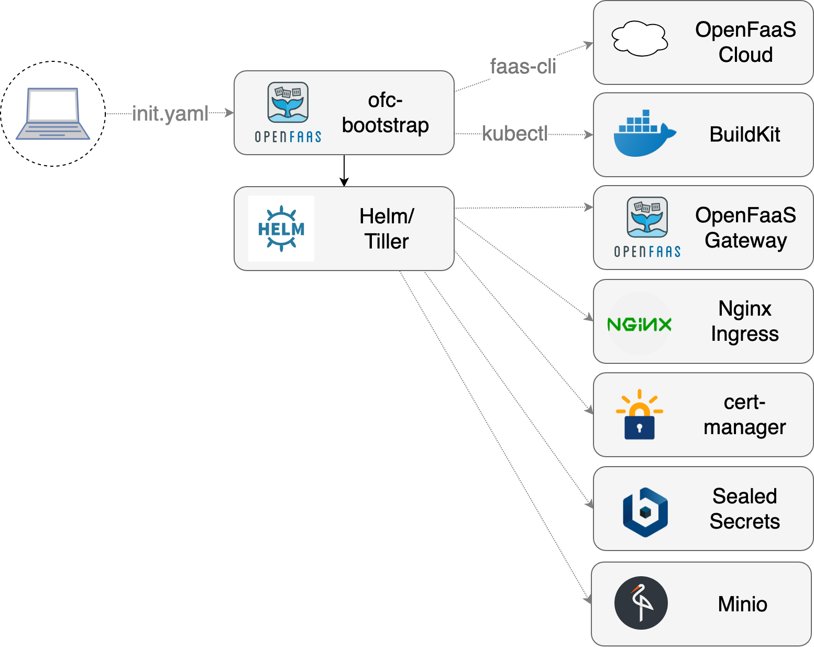

## ofc-bootstrap

> "one-click" CLI to install OpenFaaS Cloud on Kubernetes

[](https://travis-ci.org/openfaas-incubator/ofc-bootstrap)

### What is this and who is it for?

You can use this tool to configure a Kubernetes cluster with [OpenFaaS Cloud](https://github.com/openfaas/openfaas-cloud). You just need to complete all the pre-requisites and fill out your `init.yaml` file then run the tool. It automates several pages of manual steps using Golang templates and bash scripts so that you can get your own [OpenFaaS Cloud](https://github.com/openfaas/openfaas-cloud) in around 1.5 minutes.

Experience level: intermediate Kubernetes & cloud.

The `ofc-bootstrap` will install the following components:

* [OpenFaaS](https://github.com/openfaas/faas) installed with helm
* [Nginx as your IngressController](https://github.com/kubernetes/ingress-nginx) - with rate-limits configured
* [SealedSecrets](https://github.com/bitnami-labs/sealed-secrets) from Bitnami - store secrets for functions in git
* [cert-manager](https://github.com/jetstack/cert-manager) - provision HTTPS certificates with LetsEncrypt
* [buildkit from Docker](https://github.com/moby/buildkit) - to building immutable Docker images for each function
* Authentication/authorization - through OAuth2 delegating to GitHub/GitLab
* Deep integration into GitHub/GitLab - for updates and commit statuses
* A personalized dashboard for each user

### Conceptual design

The ofc-bootstrap tool is used to install OpenFaaS Cloud in a single click. You will need to configure it with all the necessary secrets and configuration beforehand using a YAML file.



> ofc-bootstrap packages a number of primitives such as an IngressController, a way to obtain certificates from LetsEncrypt, the OpenFaaS Cloud components, OpenFaaS itself and Minio for build log storage. Each component is interchangeable.

### Video demo

View a video demo by Alex Ellis running `ofc-bootstrap` in around 100 seconds on DigitalOcean.

[](https://www.youtube.com/watch?v=Sa1VBSfVpK0)

## Roadmap

See the [ROADMAP.md](./ROADMAP.md) for features, development status and backlogs. 

## Installation

You will need admin access to a Kubernetes cluster, some CLI tooling and a GitHub.com account or admin access to a self-hosted GitLab instance.

### Pre-reqs

This tool automates the installation of OpenFaaS Cloud on Kubernetes. Before starting you will need to install some tools and then create either a local or remote cluster.

For your cluster the following specifications are recommended:

* 2-3 nodes with 1-2 vCPU and 2-4GB RAM each

These are guidelines and not a hard requirement, you may well be able to run with fewer resources, such as with a single 2vCPU node with 2GB RAM.

#### Credentials and dependent systems

OpenFaaS Cloud installs, manages, and bundles software which spans source-control, TLS, DNS, and Docker image registries. You must have the following prepared before you start your installation.

* You'll need to register a domain-name and set it up for management in Google Cloud DNS, DigitalOcean or AWS Route 53.
* Set up a registry - the simplest option is to use your [Docker Hub](https://hub.docker.com) account. You can also use your own private registry or a cloud-hosted registry. You will need the credentials. If you need to, [set up your own private registry](https://github.com/alexellis/k8s-tls-registry).
* `docker` installed locally so that you can provide the `config.json` file with credentials.
* Admin-level access to a GitHub.com account or a self-hosted GitLab installation.
* A valid email address for use with [LetsEncrypt](https://letsencrypt.org), beware of [rate limits](https://letsencrypt.org/docs/rate-limits/).
* Admin access to a Kubernetes cluster.
* The ability to create one or more git repositories - one will be for your `CUSTOMERS` Access-Control List ACL and the other will be your test repository to check that everything worked.

#### Tools

* Kubernetes - [development options](https://blog.alexellis.io/be-kind-to-yourself/)
    * [kubectl](https://kubernetes.io/docs/tasks/tools/install-kubectl/#install-kubectl-binary-using-curl)
* Linux or Mac. Windows if `bash` is available
* [dep](https://github.com/golang/dep)
* [helm](https://docs.helm.sh/using_helm/#installing-helm)
* [faas-cli](https://github.com/openfaas/faas-cli) `curl -sL https://cli.openfaas.com | sudo sh`
* OpenSSL - the `openssl` binary must be available in `PATH`

If you are using a cluster with GKE then you must run the following command:

```bash
kubectl create clusterrolebinding "cluster-admin-$(whoami)" \
    --clusterrole=cluster-admin \
    --user="$(gcloud config get-value core/account)"
```

### Create a Kubernetes cluster

You may already have a Kubernetes cluster, if not, then follow the instructions below.

Pick either A or B.

#### A)  Create a production cluster

You can create a managed or self-hosted Kubernetes cluster using a Kubernetes engine from a cloud provider, or by running either `kubeadm` or `k3s`.

Cloud-services:

* [DigitalOcean Kubernetes](https://www.digitalocean.com/products/kubernetes/) (recommended)
* [AKS](https://docs.microsoft.com/en-us/azure/aks/)
* [EKS](https://docs.aws.amazon.com/eks/latest/userguide/what-is-eks.html)
* [GKE](https://cloud.google.com/kubernetes-engine/)

Local / on-premises:

* [k3s](https://k3s.io) (recommended)
* [kubeadm](https://kubernetes.io/docs/setup/production-environment/tools/kubeadm/create-cluster-kubeadm/)

Once set up make sure you have set your `KUBECONFIG` and / or `kubectl` tool to point at a the new cluster.

Check this with:

```sh
kubectl config get-contexts
```

Do not follow the instructions for B).

#### B) Create a local cluster for development / testing

For testing you can create a local cluster using `kind`, `minikube` or Docker Desktop. This is how you can install `kind` to setup a local cluster in a Docker container.

First install [Go 1.10 or newer](https://golang.org/dl/)

* Set your `GOPATH` if you don't already have one

```bash
export GOPATH=$HOME/go
```

* Download and build `kind`

Now use `go get` to install `kind` and point your `KUBECONFIG` variable at the new cluster.

```bash
go get sigs.k8s.io/kind
kind create cluster --name 1

export KUBECONFIG=$(kind get kubeconfig-path --name 1)
```

### Get `ofc-bootstrap`

Now clone the GitHub repository, download the binary release and start customising your own `init.yaml` file.

* Clone the  `ofc-bootstrap` repository

```bash
mkdir -p $GOPATH/src/github.com/openfaas-incubator
cd $GOPATH/src/github.com/openfaas-incubator/
git clone https://github.com/openfaas-incubator/ofc-bootstrap
```

* Download the latest `ofc-bootstrap` binary release from GitHub

Either run the following script, or follow the manual steps below.

```sh
# Download and move to /usr/local/bin
curl -sLSf https://raw.githubusercontent.com/openfaas-incubator/ofc-bootstrap/master/get.sh | \
 sudo sh

# Or, download and move manually
curl -sLSf https://raw.githubusercontent.com/openfaas-incubator/ofc-bootstrap/master/get.sh | \
 sh
```

Manual steps:

Download [ofc-boostrap](https://github.com/openfaas-incubator/ofc-bootstrap/releases) from the GitHub releases page and move it to `/usr/local/bin/`.

You may also need to run `chmod +x /usr/local/bin/ofc-bootstrap`.

For Linux use the binary with no suffix, for MacOS, use the binary with the `-darwin` suffix.

### Create your own `init.yaml`

Create your own `init.yaml` file from the example:

```sh
cp example.init.yaml init.yaml
```

In the following steps you will make a series of edits to the `init.yaml` file to customize it for your OpenFaaS Cloud installation.

Each setting is described with a comment to help you decide what value to set.

#### Set the `root_domain`

Edit `root_domain` and add your own domain i.e. `example.com` or `ofc.example.com`

If you picked a root domain of `example.com`, then your URLs would correspond to the following:

* `system.example.com`
* `auth.system.example.com`
* `*.example.com`

After the installation has completed in a later step, you will need to create DNS A records with your DNS provider. You don't need to create these records now.

#### Prepare your Docker registry

Log into your own private Docker registry, or the [Docker Hub](https://hub.docker.com):

* Open the Docker for Mac/Windows settings and uncheck "store my password securely" / "in a keychain"
* Run `docker login` to populate `~/.docker/config.json` - this will be used to configure your Docker registry or Docker Hub account for functions.

Find the section of the YAML `registry: docker.io/ofctest/`

You need to replace the value for your registry, note the final `/` which is required.

* Valid: `registry: docker.io/my-org/`
* Invalid: `registry: docker.io/my-org`

* Valid: `registry: my-corp.jfrog.io/ofc-prod/`
* Invalid: `registry: my-corp.jfrog.io/ofc-prod`
* Invalid: `registry: my-corp.jfrog.io/`

#### Pick your Source Control Management (SCM)

Choose SCM between GitHub.com or GitLab self-hosted.

For GitHub set:

```yaml
scm: github
```

For GitLab set:

```yaml
scm: gitlab
```

#### Setup your GitHub or GitLab integration

Setup the GitHub / GitLab App and OAuth App

Your SCM will need to send webhooks to OpenFaaS Cloud's github-event or gitlab-event function for CI/CD. This is protected by a confidential secret called a *Webhook secret*. You can leave the field blank to have one generated for you, or you can set your own in `init.yaml`.

* For GitHub create a GitHub App and download the private key file
  * Read the docs for how to [configure your GitHub App](https://docs.openfaas.com/openfaas-cloud/self-hosted/github/)
  * Leave the `value:` for `github-webhook-secret` blank for an auto-generated password, or set your own password in the GitHub App UI and in this section of the YAML.
  * Update `init.yaml` where you see the `### User-input` section
  * Set `app_id:` under the section named `github` with GitHub App's ID
  * If not using a generated value, set the `github-webhook-secret` literal value with your *Webhook secret* for the GitHub App's
  * Click *Generate a private key*, this will be downloaded to your local computer (if you ever need a new one, generate a new one and delete the old key)
  * Update the `private-key` `value_from` to the path of the GitHub App's private key

* For GitLab create a System Hook
  * Leave the `value:` for `gitlab-webhook-secret` blank, or set your own password
  * Update the `### User-input` section including your System Hook's API Token and *Webhook secret*
* Create your GitHub / GitLab OAuth App which is used for logging in to the dashboard
* For GitLab update `init.yaml` with your `gitlab_instance`

#### Setup your access control

Access control to your OFC is controlled by a text file containing a list of valid usernames or organisations. This list only needs to contain organisation names, or the names of the users who are hosting repositories that OFC will manage.

Create a new GitHub repository with a CUSTOMERS Access Control List (ACL) file.

> Note: This repository should not contain any code or functions.

* Create a new public GitHub repo
* Add a file named `CUSTOMERS` and place each username or GitHub org you will use on a separate line
* Find the GitHub "raw" URL (CDN)
* Copy and paste the raw URL into th `init.yaml` file in `customers_url: `

#### Decide if you're using a LoadBalancer

If you are using a public cloud offering and you know that they can offer a `LoadBalancer`, then the `ingress:` field will be set to `loadbalancer` which is the default.

If you are deploying to a cloud or Kubernetes cluster where the type `LoadBalancer` is unavailable then you will need to change `ingress: loadbalancer` to `ingress: host` in `init.yaml`. Nginx will be configured as a `DaemonSet` exposed on port `80` and `443` on each node in your cluster. It is recommended that you create a DNS mapping between a chosen name and the IP of each node.

> Note: it is a common error for new users to try to access the dashboard using the IP address of the load-balancer.
> You must use the DNS name for the dashboard: i.e. `system.example.com/dashboard/username`

#### Use authz (recommended)

If you'd like to restrict who can log in to just those who use a GitHub account then create a GitHub OAuth App or the equivalent in GitLab.

* Set `enable_oauth: ` to `true`

> This feature is optional, but highly recommended

Enable `auth` and fill out the OAuth App `client_id`. Configure `of-client-secret` with the OAuth App Client Secret.
For GitLab set your `oauth_provider_base_url`.

* Set `client_id: ` in the `oauth: ` section with the value of your OAuth `client_id`
* Set `of-client-secret` in the secrets section at the top of the file using the value from your OAuth `client_secret`

#### Customise s3 (not recommended)

By default OpenFaaS Cloud will deploy Minio to keep track of your build logs. This can be customised to point at any compatible object storage service such as AWS S3 or DigitalOcean Spaces.

Set `s3_url`, `s3_region` `s3_tls` and `s3_bucket` with appropriate values.

#### Use TLS (recommended)

OpenFaaS Cloud can use cert-manager to automatically provision TLS certificates for your OpenFaaS Cloud cluster using the DNS01 challenge.

> This feature is optional, but highly recommended

Pick between the following providers for the DNS01 challenge:

* DigitalOcean DNS (free at time of writing)
* Google Cloud DNS
* AWS Route53

> See also: [cert-manager docs for ACME/DNS01](https://docs.cert-manager.io/en/latest/tasks/issuers/setup-acme/index.html)

> Note: Comment out the relevant sections and configure as necessary

You will set up the corresponding DNS A records in your DNS management dashboard after `ofc-bootstrap` has completed in the final step of the guide.

In order to enable TLS, edit the following configuration:

* Set `tls: true`
* Choose between `issuer_type: "prod"` or `issuer_type: "staging"`
* Choose between DNS Service `route53`, `clouddns` or `digitalocean` and then update `init.yaml`
* If you are using an API credential for DigitalOcean, AWS or GCP, then download that file from your cloud provider and set the appropriate path.
* Go to `# DNS Service Account secret` in `init.yaml` and choose and uncomment the section you need.

You can start out by using the Staging issuer, then switch to the production issuer.

* Set `issuer_type: "prod"` (recommended) or `issuer_type: "staging"` (for testing)

> Note if you want to switch from the staging TLS certificates to production certificates, see the appendix.

#### Enable dockerfile language support (optional)

If you are planning on building functions using the `dockerfile` template you need to set `enable_dockerfile_lang: true`.

When this value is set to `false`, your users can only use your recommended set of templates.

#### Enable scaling to zero

If you want your functions to scale to zero then you need to set `scale_to_zero: true`.

#### Set the OpenFaaS Cloud version (optional)

This value should normally be left as per the number in the master branch, however you can edit `openfaas_cloud_version` if required.

#### Toggle network policies (recommended)

Network policies restriction for the `openfaas` and `openfaas-fn` namespaces are applied by default.

When deployed, network policies restrict communication so that functions cannot talk to the core OpenFaaS components in the `openfaas` namespace. They also prevent functions from invoking each other directly. It is recommended to enable this feature.

The default behaviour is to enable policies. If you would like to remove the restrictions, then set `network_policies: false`.

### Run `ofc-bootstrap`

If you are now ready, you can run the `ofc-bootstrap` tool:

```bash
cd $GOPATH/src/github.com/openfaas-incubator/ofc-bootstrap

ofc-bootstrap -yaml=init.yaml
```

Pay attention to the output from the tool and watch out for any errors that may come up. You will need to store the logs and share them with the maintainers if you run into any issues.

### Finish the configuration

If you get anything wrong, there are some instructions in the appendix on how to make edits. It is usually easier to edit `init.yaml` and re-run the tool.

If you want to completely remove all the components that `ofc-bootstrap` installed to start-over then you can use: `./scripts/reset.sh`. Caution: read the contents of the script carefully before running it.

> Note: Be careful if you run `reset.sh` and make 100% sure that you are pointing at the correct cluster by checking `kubectl config get-context`.

#### Configure DNS

If you are running against a remote Kubernetes cluster you can now update your DNS entries so that they point at the IP address of your LoadBalancer found via `kubectl get svc`.

When ofc-bootstrap has completed and you know the IP of your LoadBalancer:

* `system.example.com`
* `auth.system.example.com`
* `*.example.com`

#### Configure the GitHub / GitLab App Webhook

Now over on GitHub / GitLab enter the URL for webhooks:

GitHub.com:

```
http://system.example.com/github-event
```

GitLab self-hosted:

```
http://system.example.com/gitlab-event
```

For more details see the [GitLab instructions](https://github.com/openfaas/openfaas-cloud/blob/master/docs/GITLAB.md) in OpenFaaS Cloud.

Then you need to enter the Webhook secret that was generated during the bootstrap process. Run the following commands to extract and decode it:

```sh
export SECRET=$(kubectl get secret -n openfaas-fn github-webhook-secret -o jsonpath="{.data.github-webhook-secret}" | base64 --decode; echo)

echo "Your webhook secret is: $SECRET"
```

Open the Github App UI and paste in the value into the "Webhook Secret" field.

### Smoke-test

Now check the following and run a smoke test:

* DNS is configured to the correct IP
* Check TLS certificates are issued as expected
* Check that you can trigger a build
* Check that your build is pushing images to your registry or the Docker Hub
* Check that your endpoint can be accessed 

#### View your dashboard

Now view your dashboard over at:

```
http://system.example.com/dashboard/<username>
```

Just replace `<username>` with your GitHub account. 

#### Trigger a build

Now you can install your GitHub app on a repo, run `faas-cli new` and then rename the YAML file to `stack.yml` and do a `git push`. Your OpenFaaS Cloud cluster will build and deploy the functions found in that GitHub repo.

If you're unsure how to do this, then you could use the [QuickStart for the Community Cluster](https://github.com/openfaas/community-cluster/tree/master/docs), just remember to change the URLs to your own cluster.

### Something went wrong?

If you think that everything is set up correctly but want to troubleshoot then head over to the GitHub App webpage and click "Advanced" - here you can find each request/response from the GitHub push events. You can resend them or view any errors.

#### Still not working? 

Follow the detailed [Troubleshooting Guide](https://docs.openfaas.com/openfaas-cloud/self-hosted/troubleshoot/#still-not-working) in the OpenFaaS docs. If you are still stuck after that please chat with us in #openfas-cloud on Slack.

#### Access your OpenFaaS UI or API

OpenFaaS Cloud abstracts away the core OpenFaaS UI and API. Your new API is driven by pushing changes into a Git repository, rather than running commands, or browsing a UI.

You may still want access to your OpenFaaS cluster, in which case run the following:

```sh
# Fetch your generated admin password:

export PASSWORD=$(kubectl get secret -n openfaas basic-auth -o jsonpath="{.data.basic-auth-password}" | base64 --decode; echo)

# Open a tunnel to the gateway using `kubectl`:
kubectl port-forward -n openfaas deploy/gateway 31112:8080 &

# Point the CLI to the tunnel:
export OPENFAAS_URL=http://127.0.0.1:31112

# Log in:
echo -n $PASSWORD | faas-cli login --username admin --password-stdin
```

At this point you can also view your UI dashboard at: http://127.0.0.1:31112

#### Re-deploy the OpenFaaS Cloud functions (advanced)

If you run the step above `Access your OpenFaaS UI or API`, then you can edit settings for OpenFaaS Cloud and redeploy your functions. This is an advanced step.

```
cd tmp/openfaas-cloud/

# Edit stack.yml
# Edit github.yml or gitlab.yml
# Edit gateway_config.yml
# Edit buildshiprun_limits.yml

# Update all functions
faas-cli deploy -f stack.yml

# Update a single function, such as "buildshiprun"
faas-cli deploy -f stack.yml --filter=buildshiprun
```

### Invite your team

For each user or org you want to enroll into your OpenFaaS Cloud edit the `CUSTOMERS` ACL file and add their username on a new line.

```
openfaas
alexellis
```

#### Switch from staging to production TLS

When you want to switch to the Production issuer from staging do the following:

Flush out the staging certificates and orders

```sh
kubectl delete certificates --all  -n openfaas
kubectl delete secret -n openfaas -l="certmanager.k8s.io/certificate-name"
kubectl delete order -n openfaas --all
```

Now update the staging references to "prod":

```sh
sed -i '' s/letsencrypt-staging/letsencrypt-prod/g ./tmp/generated-ingress-ingress-wildcard.yaml
sed -i '' s/letsencrypt-staging/letsencrypt-prod/g ./tmp/generated-ingress-ingress.yaml
sed -i '' s/letsencrypt-staging/letsencrypt-prod/g ./tmp/generated-tls-auth-domain-cert.yml
sed -i '' s/letsencrypt-staging/letsencrypt-prod/g ./tmp/generated-tls-wildcard-domain-cert.yml
```

Now create the new ingress and certificates:

```sh
kubectl apply -f ./tmp/generated-ingress-ingress-wildcard.yaml
kubectl apply -f ./tmp/generated-ingress-ingress.yaml
kubectl apply -f ./tmp/generated-tls-auth-domain-cert.yml
kubectl apply -f ./tmp/generated-tls-wildcard-domain-cert.yml
```

### Join us on Slack

Got questions, comments or suggestions?

Join the team and community over on [Slack](https://docs.openfaas.com/community)

